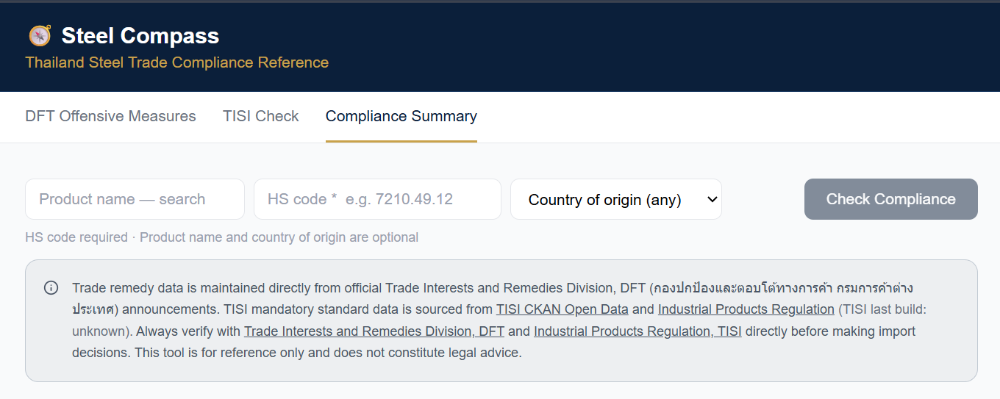

# Hi, I'm Kwanta 👋

**Business Systems Designer**

I design practical software that helps people make better business decisions.

My work combines:

- 🌏 19 years in international trade
- 💻 AI-assisted software development
- 🏗️ Business systems design
- 📊 Product thinking

---

# 🧭 Current Project

## Steel Compass

> Compliance decision-support system for steel importers in Thailand

⭐ Live Demo

https://steel-compass.vercel.app

📘 Project Documentation

https://github.com/Missboonyos/steel-compass-docs

---

# 💻 Tech Stack

Frontend

- React
- TypeScript
- Vite
- Tailwind CSS

Backend / Data

- Supabase
- PostgreSQL

Tools

- Git
- GitHub
- Python
- OpenAI

Architecture

- Decision Support Systems
- System Design
- Product Architecture

---

# 🌱 Currently exploring

- AI Agents
- System Design
- Product Engineering
- Cloud Architecture

---

# 🎯 Career Goal

Building software products that bridge business expertise with modern software engineering.

---

## 🧭 My approach

I believe software should help people make better decisions,
not replace their judgement.

I enjoy building products where business expertise,
clear system thinking,
and software engineering come together.

---
💙 Thanks for visiting my profile!
